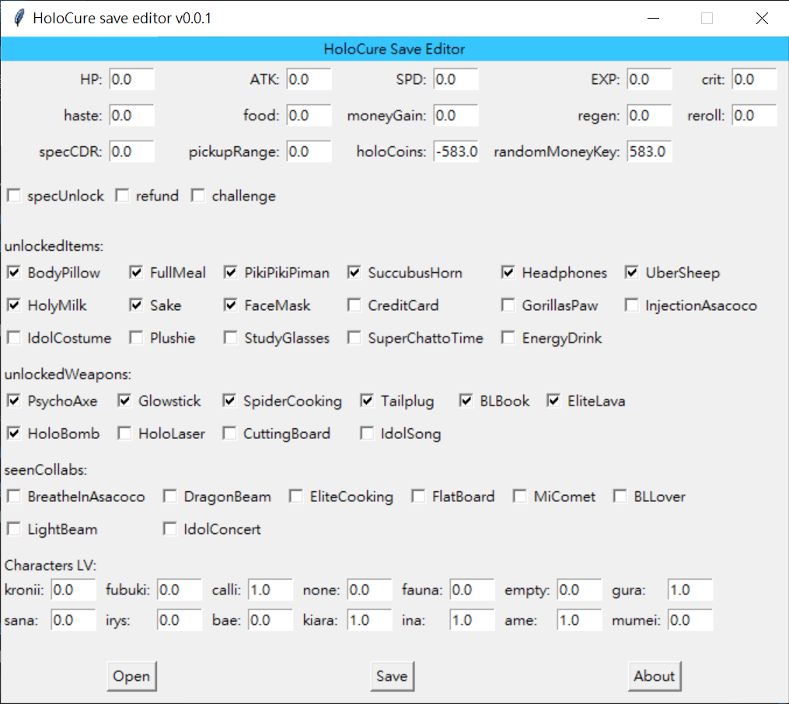

# Holocure Save Tool
A simple save Tool for Holocure fan game.
Download (exe): https://github.com/aclich/Holocure_save_editor/releases/download/v0.0.3-C/HoloCure_Save_Tool_v0.0.3_C.zip  
- Support game version 0.4.1663293877
- Add scroll bar in editor. (issue https://github.com/aclich/Holocure_save_editor/issues/6#issue-1376130532)
- Fix Issue https://github.com/aclich/Holocure_save_editor/issues/8


### Known Issue:
  - Not compatible with older game version of save.

### v0.0.3 Expected Update:
  - Basic compatible with previous save version. 🚀
  - Optimize UI ⏸️

#### Virus detected issue
The released exe is packed by pyinstaller, and it will cause **false positives** in some anti-virus software. Please don't worry if you downloaded or used it. To see my full explanation, please refer to https://github.com/aclich/Holocure_save_editor/issues/4#issuecomment-1174153928.  

## Feature:
#### Save editing:
  - Holocoin
  - Shop items
  - Charactor gacha level
  - Tears
  - Lock, Unlock items/weapons/collabs/outfits/stages

#### Save Inheritance (Transfer):
  - Help player Inherit save from other PC to current PC.  

#### Screenshot:


##  How to Use (exe)
0. Select which tool to use `(editor or Inheritance tool)`
- Editor:
  1. Select the save file (Default path: 'C:\\Users\\<user_name>\\AppData\\Local\\HoloCure\\save.dat')
  2. Change the data in editor
  3. Save the data and replace the original save file (please manually backup the original save file)
- Inheritance Tool:
    1. Select save from other PC (Or the save you want to inheritance)
    2. Select save in current PC (Already selected in default, make sure the save file exists. If not, run the game first.)
    3. Click Run.

## Run from source code
### Requirements
- python > 3.6
### Steps  
0. Install python if haven't (version > 3.6)
1. git clone https://github.com/aclich/Holocure_save_editor.git
2. cd Holocure_save_editor
3. python holocure_save_editor.py  

- - - 
 
***Note**
Build Command:
>```
>pyinstaller.exe --upx-dir <Path to upx> --noconsole --onefile --name HoloCure_Save_Tool_{VERSION} --icon <Path to Icon> .\holocure_save_tool.py --clean
>```